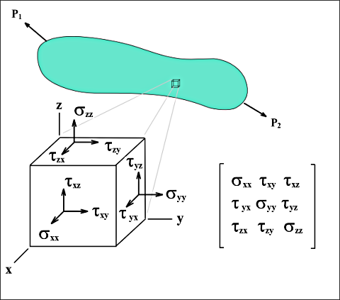
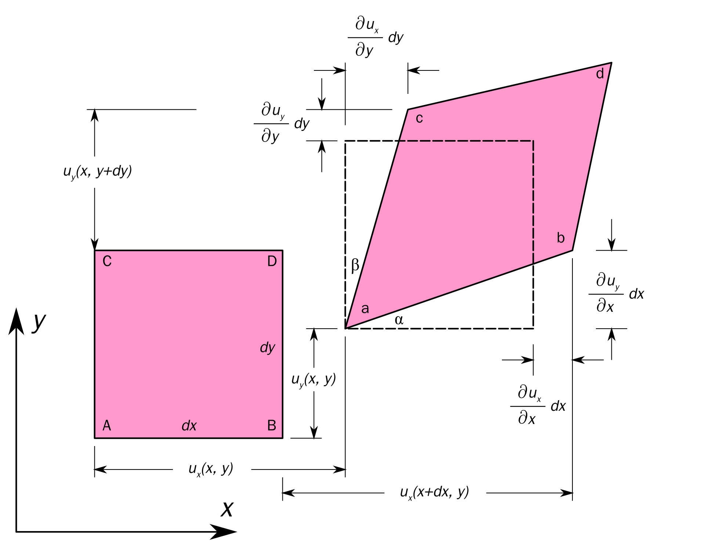

## Описание напряженного состояния упругого тела
### Тензор напряжений (тензор Коши)

Тензор напряжений — это симметричный тензор, который описывает распределение внутренних сил в материале. Он показывает, какие напряжения (силы на единицу площади) действуют на бесконечно малые площадки, проходящие через данную точку тела.

#### Компоненты тензора напряжений в декартовой системе координат

$$
\boldsymbol{\sigma} =
\begin{bmatrix}
\sigma_{xx} & \sigma_{xy} & \sigma_{xz} \\
\sigma_{yx} & \sigma_{yy} & \sigma_{yz} \\
\sigma_{zx} & \sigma_{zy} & \sigma_{zz}
\end{bmatrix}, где:
$$

- Диагональные компоненты $\sigma_{xx}, \sigma_{yy}, \sigma_{zz}$ — нормальные напряжения (растяжение/сжатие).
- Недиагональные компоненты $\sigma_{xy}, \sigma_{yz}$ и т.д. — касательные (сдвиговые) напряжения.
- По закону парности касательных напряжений: $\sigma_{ij} = \sigma_{ji}$. Т.е. тензор симметричен, и содержит 6 независимых компонент.

Если через точку провести площадку с нормалью $\vec{n}$, то вектор напряжений на этой площадке:

$$
\vec{T}^{(n)} = \boldsymbol{\sigma} \cdot \vec{n}
$$

### Тензор деформаций

**Тензор деформаций** - это симметричный тензор, который описывает изменения формы и размеров бесконечно малого элемента тела (удлинения, сдвиги).

#### Компоненты тензора малых деформаций в декартовой системе координат

$$
\boldsymbol{\varepsilon} =
\begin{bmatrix}
\varepsilon_{xx} & \varepsilon_{xy} & \varepsilon_{xz} \\
\varepsilon_{yx} & \varepsilon_{yy} & \varepsilon_{yz} \\
\varepsilon_{zx} & \varepsilon_{zy} & \varepsilon_{zz}
\end{bmatrix}, где:
$$
$$
\begin{gather}
\varepsilon_{xx} = \dfrac{\partial u_x}{\partial x}, \varepsilon_{yy} = \dfrac{\partial u_y}{\partial y}, \varepsilon_{zz} = \dfrac{\partial u_z}{\partial z} \\
\varepsilon_{xy} = \varepsilon_{yx} = \dfrac{1}{2} \left( \dfrac{\partial u_x}{\partial y} + \dfrac{\partial u_y}{\partial x} \right)
\end{gather}
$$
- $\varepsilon_{xx}, \varepsilon_{yy}, \varepsilon_{zz}$ — относительные удлинения (нормальные деформации),
- $\varepsilon_{xy}, \varepsilon_{yx}$ — половина угла сдвига в плоскости \(xy\),
- Аналогично для других компонент.

### Связь между тензорами напряжений и деформаций - физические уравнения

Для линейно упругих тел связь между напряжениями и деформациями задаётся законом Гука:

$$
\sigma_{ij} = C_{ijkl} \, \varepsilon_{kl},
$$

где $C_{ijkl}$ — тензор упругих постоянных. Он содержит 81 компонент, которые в общем случае (анизотропное тело) сводятся к 21 упругой константе, а для изотропного тела — к 2: модуль Юнга и коэффициент Пуассона.

Для изотропного материала закон Гука в развёрнутом виде:

$$
\begin{cases}
\sigma_{xx} = \lambda (\varepsilon_{xx} + \varepsilon_{yy} + \varepsilon_{zz}) + 2\mu \varepsilon_{xx} \\
\sigma_{yy} = \lambda (\varepsilon_{xx} + \varepsilon_{yy} + \varepsilon_{zz}) + 2\mu \varepsilon_{yy} \\
\sigma_{zz} = \lambda (\varepsilon_{xx} + \varepsilon_{yy} + \varepsilon_{zz}) + 2\mu \varepsilon_{zz} \\
\sigma_{xy} = 2\mu \varepsilon_{xy} \\
\sigma_{yz} = 2\mu \varepsilon_{yz} \\
\sigma_{zx} = 2\mu \varepsilon_{zx} \\
\end{cases}
$$

где $\lambda, \mu$ — коэффициенты, которые называют постоянными Ламе. Через модуль Юнга $E$ и коэффициент Пуассона $\nu$ параметры Ламе выражаются следующим образом:

$$\lambda=\frac{\nu E}{(1+\nu)(1-2\nu)}$$
$$\mu=\frac{E}{2(1+\nu)}$$

Второй коэффициент Ламе $\mu$ также называют модулем сдвига и обозначают $G$.

### Общая форма уравнений равновесия

В случае отсутствия сил инерции и при условии статического равновесия уравнения записываются так:

$$
\begin{cases}
\dfrac{\partial \sigma_{xx}}{\partial x} + \dfrac{\partial \sigma_{xy}}{\partial y} + \dfrac{\partial \sigma_{xz}}{\partial z} + f_x = 0 \\
\dfrac{\partial \sigma_{yx}}{\partial x} + \dfrac{\partial \sigma_{yy}}{\partial y} + \dfrac{\partial \sigma_{yz}}{\partial z} + f_y = 0 \\
\dfrac{\partial \sigma_{zx}}{\partial x} + \dfrac{\partial \sigma_{zy}}{\partial y} + \dfrac{\partial \sigma_{zz}}{\partial z} + f_z = 0
\end{cases}
$$
где $f_x, f_y, f_z$ — это объемные силы, например, компоненты силы тяжести

### Граничные условия
Граничные условия обычно задаются по поверхности деформированного тела. Тело условно делится на две части: на одной частb граничные условия задаются через нагрузки, на другой - через перемещения.

### Итого
Приведенные выше соотношения составляют систему уравнений для трехмерного упругого тела в прямоугольной системе координат: соотношения между деформациями и перемещениями (1) и (2), уравнения равновесия, физические зависимости и граничные условия. Всего имеются 15 неизвестных: 6 напряжений, 6 деформаций и 3 перемещения. В этой системе уравнений часто прибегают к замене отдельных групп уравнений. На различные вариационные принципы, например:
- прицип возможных перемещений (стационарность полной потенциальной энергии);
- метод Рэлея-Ритца;
- смешанные вариационные принципы.
